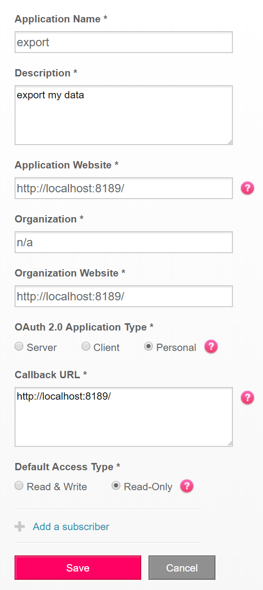
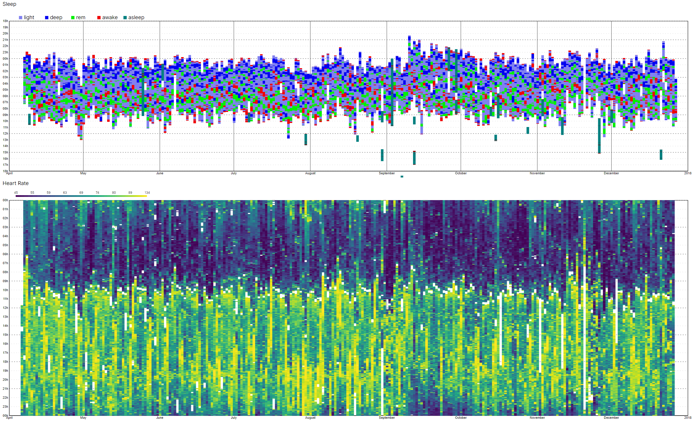

# MyFitbit

Because *"Your data belongs to you!"*

...and fitbit's own data export sucks.


## Installation


Manual:

```sh
git clone git@github.com:Knio/myfitbit
cd myfitbit
python3 setup.py install
```


## Setup

1. Register a new app at https://dev.fitbit.com/apps/new

The app should look like this:

The Callback URL must be exactly `http://localhost:8189/`




2. Configure the API keys

Make a file `config.ini` in your working directory with the client ID and secret you got from registering the fitbit app:

```
[fitbit_auth]
client_id = 123ABCD
client_secret = 0123456789abcdef0a1b2c3d4f5
```


2. Export your data

```
python3 -m myfitbit
```

This will open a web browser and prompt you to allow the app to access your data.

It will then begin exporting to your current working directory.

Note that the fitbit API is rate limited to 150 calls/hour, and you can query only 1 day of heartrate data at a time. If you many days of data, you will be rate limited and see an HTTP 429 error. Simply re-run the command an hour later and it will resume downloading where it left off.

3. Generate report


```
python3 -m myfitbit.report --user 123ABC
```

Use the user id seen in the output from step 2

This will generate `report.html` in your current working directory.


